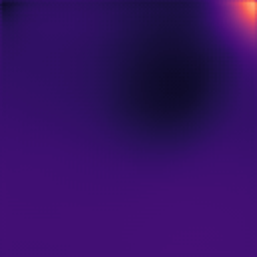
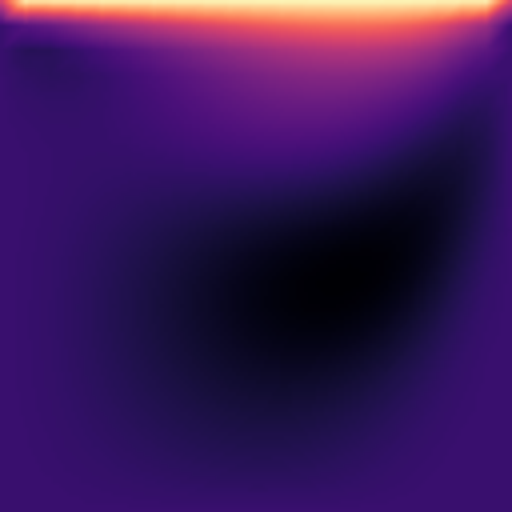
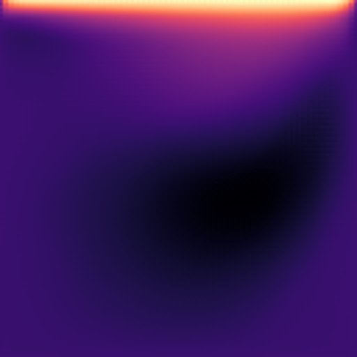
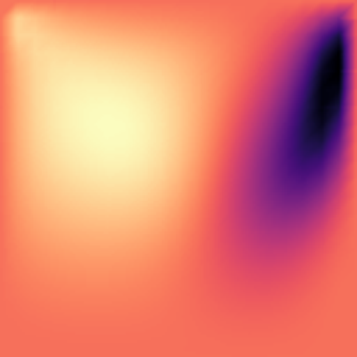
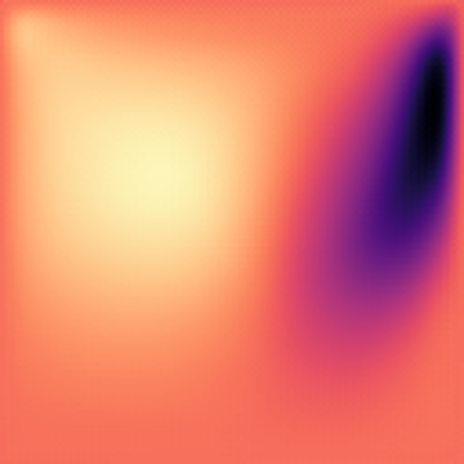
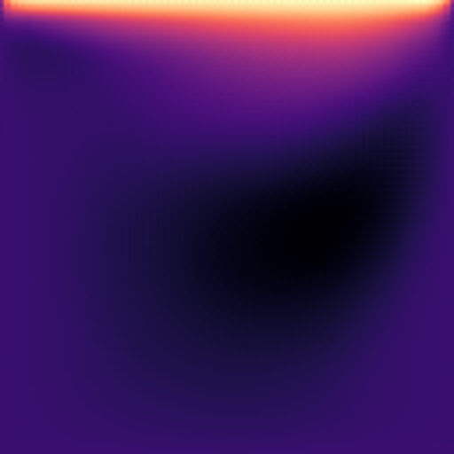
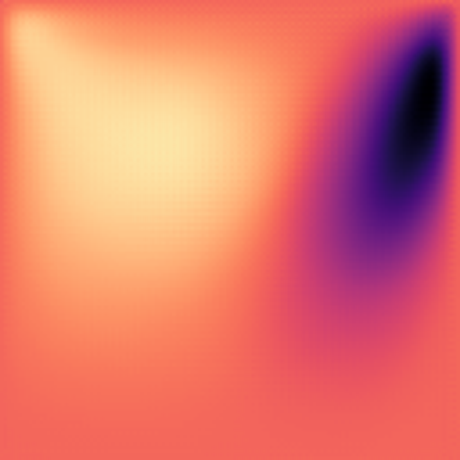

# UNet-CFD-FrameWork-cavity

[](https://github.com/Tes-bo)
[](mailto:cotsqa@qq.com)
[](https://www.openfoam.com/)
[](https://www.gnu.org/licenses/gpl-3.0.html)

A deep learning framework for predicting cavity-driven flow fields using U-Net architecture combined with OpenFOAM CFD simulations.

**Author:** 🦖🦕 Tesbo
**Contact:** cotsqa@qq.com

## Overview

This project trains a U-Net neural network to learn the mapping from boundary conditions (lid velocity and Reynolds number) to flow fields (pressure and velocity). The training data is generated automatically using OpenFOAM CFD simulations.

> **⚠️ IMPORTANT NOTICE**  
> If you use, modify, or reference this work in any publication, project, or derivative work, you **MUST**:
> - Acknowledge the original author: **Tesbo**
> - Provide a link to this repository: `https://github.com/Tes-bo/UNet-CFD-FrameWork-cavity`
> - See the [Citation](#citation) section for proper attribution format

## Features

- **Automated Data Generation**: Generate parametric CFD datasets with varying Reynolds numbers and lid velocities
- **U-Net Architecture**: 6-layer encoder-decoder network with skip connections
- **Multi-GPU Support**: Automatic DataParallel training on multiple GPUs
- **Early Stopping**: Smart training termination to prevent overfitting
- **Comprehensive Visualization**: Automatic generation of comparison plots

## System Requirements

| Component | Minimum | Recommended |
|-----------|---------|-------------|
| CPU | 4 cores | 8+ cores |
| RAM | 8 GB | 16+ GB |
| GPU | None | 4+ GB VRAM |
| Disk | 10 GB | 50+ GB |

## Dependencies

- Python 3.6+
- OpenFOAM v2412
- PyTorch
- NumPy
- Pillow
- Matplotlib

### Installation

```bash
# Install Python dependencies
pip install torch torchvision numpy pillow matplotlib

# Ensure OpenFOAM is installed and sourced
source /path/to/OpenFOAM/etc/bashrc
```

## Quick Start

### One-Click Execution

```bash
cd UNet-CFD-FrameWork-cavity
./run_all.sh
```

Follow the prompts to complete data generation, training, and testing.

### Manual Execution

#### Step 1: Generate Training Data

```bash
cd data
python3 dataGen.py
```

This generates CFD simulations with random parameters, samples them to 128×128 grids, and saves as `.npz` files. Default: 200 samples split into train/validation/test (70%/15%/15%).

**Time estimate:** ~30-60 minutes for 200 samples

#### Step 2: Train the Model

```bash
cd train
python3 runTrain.py
```

Training will automatically use GPU if available. The model is saved periodically to `../data/models/`.

**Time estimate:** ~2-4 hours (GPU) or 12-24 hours (CPU) for 10,000 iterations

#### Step 3: Test and Evaluate

```bash
cd train
python3 runTest.py
```

Generates predictions on test set and saves comparison plots to `../data/test_results/`.

## Project Structure

```
UNet-CFD-FrameWork-cavity/
├── data/
│   ├── dataGen.py          # Data generation script
│   ├── utils.py            # Utility functions
│   ├── train/              # Training dataset
│   ├── validation/         # Validation dataset
│   ├── test/               # Test dataset
│   ├── models/             # Saved models
│   └── test_results/       # Prediction results
│
├── train/
│   ├── DfpNet.py           # U-Net model definition
│   ├── dataset.py          # Data loader
│   ├── runTrain.py         # Training script
│   ├── runTest.py          # Testing script
│   └── utils.py            # Visualization tools
│
├── cavity/                 # OpenFOAM case template
│   ├── 0/                  # Initial conditions
│   ├── constant/           # Fluid properties
│   └── system/             # Solver settings
│
├── run_all.sh              # Automated pipeline
└── clean_results.sh        # Clean generated files
```

## Configuration

### Data Generation (`data/dataGen.py`)

```python
samples = 200                   # Number of samples to generate
lid_velocity_min = 0.1         # Minimum lid velocity (m/s)
lid_velocity_max = 10.0        # Maximum lid velocity (m/s)
reynolds_min = 10              # Minimum Reynolds number
reynolds_max = 1000            # Maximum Reynolds number

train_ratio = 0.7              # Training set ratio
validation_ratio = 0.15        # Validation set ratio
test_ratio = 0.15              # Test set ratio
```

### Training (`train/runTrain.py`)

```python
iterations = 10000             # Training iterations
batch_size = 32                # Batch size
lrG = 0.0006                   # Learning rate
expo = 6                       # Channel exponent (channels = 2^expo)
dropout = 0.0                  # Dropout rate

# Early stopping parameters
use_early_stopping = True
patience = 50                  # Epochs to wait for improvement
min_delta = 1e-6              # Minimum improvement threshold
```

### Network Size vs Resources

| expo | Initial Channels | Parameters | VRAM Required |
|------|------------------|------------|---------------|
| 4    | 16              | ~200K      | ~2 GB         |
| 5    | 32              | ~800K      | ~4 GB         |
| 6    | 64              | ~3M        | ~8 GB         |
| 7    | 128             | ~12M       | ~16 GB        |

## Data Format

**Input** (3 channels, 128×128):
- Channel 0: Lid velocity X (normalized)
- Channel 1: Lid velocity Y (always 0)
- Channel 2: Reynolds number (log-normalized)

**Output** (3 channels, 128×128):
- Channel 0: Pressure field
- Channel 1: Velocity X
- Channel 2: Velocity Y

## Model Architecture

- **Type:** U-Net with 6 encoder and 6 decoder layers
- **Activation:** ReLU (encoder uses LeakyReLU)
- **Normalization:** Batch Normalization
- **Skip Connections:** Concatenation between encoder and decoder
- **Loss Function:** L1 Loss (MAE)
- **Optimizer:** Adam (lr=0.0006, betas=(0.5, 0.999))

## Performance

| Metric | Value |
|--------|-------|
| Data Generation | 20-30 samples/minute |
| Training (GPU) | 3-5 minutes |
| Inference | <0.05 seconds/sample |
| Accuracy (L1) | <0.1 (good), <0.05 (excellent) |
| Model Size | 30-40 MB |

## Results

This section demonstrates the comparison between U-Net model predictions and OpenFOAM CFD simulation results. The model accurately predicts pressure and velocity fields in cavity-driven flows.

### Example 1: Pressure Field Prediction Comparison

<div align="center">
<table>
  <tr>
    <td align="center"><b>CFD Simulation (Target)</b></td>
    <td align="center"><b>U-Net Prediction</b></td>
  </tr>
  <tr>
    <td></td>
    <td></td>
  </tr>
</table>
</div>

The pressure field shows the distribution inside the cavity. The model successfully captures the pressure gradients induced by the central vortex structure.

### Example 2: X-Velocity Field Prediction Comparison

<div align="center">
<table>
  <tr>
    <td align="center"><b>CFD Simulation (Target)</b></td>
    <td align="center"><b>U-Net Prediction</b></td>
  </tr>
  <tr>
    <td></td>
    <td></td>
  </tr>
</table>
</div>

The X-velocity field displays the horizontal velocity component distribution. The model accurately predicts the primary vortex and corner secondary vortices.

### Example 3: Y-Velocity Field Prediction Comparison

<div align="center">
<table>
  <tr>
    <td align="center"><b>CFD Simulation (Target)</b></td>
    <td align="center"><b>U-Net Prediction</b></td>
  </tr>
  <tr>
    <td></td>
    <td></td>
  </tr>
</table>
</div>

The Y-velocity field shows the vertical velocity component distribution. The model successfully reproduces the flow pattern driven by the moving lid.

### Example 4: Complete Prediction for a Single Sample (Sample 0000)

<div align="center">
<table>
  <tr>
    <td align="center"><b>Pressure Field</b></td>
    <td align="center"><b>X-Velocity Field</b></td>
    <td align="center"><b>Y-Velocity Field</b></td>
  </tr>
  <tr>
    <td></td>
    <td></td>
    <td></td>
  </tr>
</table>
</div>

This example demonstrates the complete flow field prediction for a single test sample, including pressure field and both velocity components.

### Key Observations

- **High Accuracy**: Model predictions closely match CFD simulation results
- **Vortex Structure**: Accurately captures primary vortex and corner secondary vortices
- **Boundary Conditions**: Properly handles wall boundaries and moving lid
- **Fast Inference**: Prediction time < 0.1 seconds, 1000+ times faster than CFD simulation

### Additional Results

Complete test results and visualization images are located at:
- Test result comparisons: `data/test_results/`
- Training data visualizations: `data/data_pictures/`

## Troubleshooting

### CUDA Out of Memory

**Solution:** Reduce batch size or network size
```python
batch_size = 10    # Reduce batch size
expo = 5           # Reduce network size
```

Or use CPU:
```bash
CUDA_VISIBLE_DEVICES="" python3 runTrain.py
```

### OpenFOAM Not Found

**Error:** `No such file or directory: .../bashrc`

**Solution:** Update OpenFOAM path in `dataGen.py` (line 18):
```python
openfoam_path = "/your/actual/path/to/OpenFOAM/etc/bashrc"
```

### Training Not Converging

**Solution:**
- Check data quality: visualize samples in `data/data_pictures/`
- Reduce learning rate: `lrG = 0.0003`
- Increase training iterations: `iterations = 20000`

### Poor Prediction Accuracy

**Solution:**
- Generate more training data: increase `samples`
- Train longer: increase `iterations`
- Use larger network: increase `expo`

## Configuration Presets

### Quick Test (Verify Pipeline)
```python
samples = 20
iterations = 500
batch_size = 10
expo = 4
```

### Standard Configuration (Recommended)
```python
samples = 200
iterations = 10000
batch_size = 32
expo = 6
```

### High Precision (Resource Intensive)
```python
samples = 500
iterations = 20000
batch_size = 32
expo = 7
```

## Citation

**If you use or reference this work, please cite:**

```
UNet-CFD-FrameWork-cavity
Author: Tesbo
Repository: https://github.com/Tes-bo/UNet-CFD-FrameWork-cavity
Contact: cotsqa@qq.com
```

**Or in BibTeX format:**

```bibtex
@software{tesbo2026unetcfd,
  author = {Tesbo},
  title = {UNet-CFD-FrameWork-cavity: Deep Learning Framework for Cavity Flow Prediction},
  year = {2026},
  url = {https://github.com/Tes-bo/UNet-CFD-FrameWork-cavity},
  email = {cotsqa@qq.com}
}
```

This work is based on the methodology from:

```
Thuerey et al. (2020). Deep learning methods for Reynolds-averaged 
Navier–Stokes simulations of airfoil flows. AIAA Journal, 58(1), 25-36.
```

## License

This project is licensed under the **GNU General Public License v3.0 (GPL-3.0)**.

You are free to:
- Use this software for any purpose
- Study how the program works and modify it
- Redistribute copies
- Distribute modified versions

Under the following terms:
- Source code must be made available when distributing the software
- Modifications must be released under the same license
- Changes made to the code must be documented
- **When using or referencing this work, you must acknowledge the original author (Tesbo) and provide a link to this repository**

See [LICENSE](LICENSE) file for full details or visit [GNU GPL v3.0](https://www.gnu.org/licenses/gpl-3.0.html).

## Contact

**Author:** Tesbo  
**Email:** cotsqa@qq.com

For questions, issues, or contributions, please open an issue on GitHub.

---

*Last Updated: January 2026*
